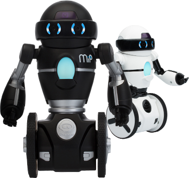

WowWee MiP Bluetooth Low Energy Protocol
===============
[](https://gitter.im/WowWeeLabs/MiP-BLE-Protocol?utm_source=badge&utm_medium=badge&utm_campaign=pr-badge&utm_content=badge)



The free MiP BLE protocol lets you send and receive commands to and from your [MiP robot](http://www.meetmip.com). You will need to write your own control code in the language of your choice using an appropriate Bluetooth Low Energy library.

Pre-built SDKs are available for iOS: https://github.com/WowWeeLabs/MiP-iOS-SDK

For information on WowWee products visit: http://www.wowwee.com/.

For your reference, due to a number of issues with some models of phones and BLE we've posted a quick [compatibility guide](http://www.wowwee.com/mip/compatibility) that's worth checking out. It's not a complete list, but just provides a reference of what phones are roughly going to work with Bluetooth Low Energy.

How to use it
-----------------------------------------------

**Finding a MiP before Connecting**

When scanning for MiPs you can use the Broadcast Data to get some basic info about MiP (such as his name) and to determine whether it's a MiP or another WowWee toy.

Here is a typical snapshot of broadcast data returned by scanning for MiPs (on iOS), yours may look slightly different but it should still have similar values:

```
   kCBAdvDataIsConnectable = 1;
   kCBAdvDataManufacturerData = <00050100 00000000 00000000 00000000 0000>;
   kCBAdvDataServiceUUIDs =     (
    "Unknown (<fff0>)",
    "Unknown (<ffb0>)"
   );
```

- kCBAdvDataManufacturerData = 000501000000000000000000000000000000

To know the difference between MiP and other BLE based products you can check the *Manufactorer Specific Data* which is sent as part of the advertising Packet. Check with your BLE framework on how to get this.

Each WowWee BLE product assigns a special 16bit ID in the first two bytes of the Manufactorer specific data. If you are using one of our prebuilt SDKs this is handled automatically for you.

Taking the first 4 digits gives us a product ID of 5, all MiPs are assigned 5 as a product ID.

- kCBAdvDataServiceUUIDs 

Please ignore these values, the only way to find the available services is by connecting to a MiP and scanning for services


**Connecing to a MiP**

Please see your BLE framework for instructions on how to connect to a BLE device. Usually the framework will give you an object and a connect command. Your code should handle mundane tasks such as reconnecting, or handling a failed connection.

**Controlling MiP**

Bluetooth Low Energy is made up of a series of Services & Characteristics. In the case of MiP these are proprietary which means you need to find them by UUID. The following important services are available:

- Receive Data Service: 0xFFE0
  - Receive Data NOTIFY Characteristic: 0xFFE4
- Send Data Service: 0xFFE5
  - Send Data WRITE Characteristic: 0xFFE9
  
Using your Bluetooth Framework of choice you can choose to run a callback everytime you receive data using the Receive Data NOTIFY Characteristic.

_**IMPORTANT**_

Please note that you can only find the above services once your connected to MiP. They will not show up in the broadcast data.

Sending command bytes is very easy, just send a raw byte according to the value in the table.

Receiving commands on the other hand need some special treatment before they can be processed as raw command bytes. All commands come in an ASCII encoded string. For example, in Objective-C you might do the following:

```objective-c
// Get ASCII command value from incoming data
NSString *ascii = [[NSString alloc] initWithData:data encoding:NSASCIIStringEncoding];

// Here we simply split the string array for every 2 characters
NSMutableArray *theDataArray = [NSMutableArray array];
for (int i = 0; i < [asciiHex length]; i=i+2) {
  NSString *cmd = [asciiHex substringWithRange:NSMakeRange(i, 2)];
  [theDataArray addObject:@([cmd hexFromString])];
}

NSUInteger cmdByte = [theDataArray[0] unsignedIntegerValue];
[theDataArray removeObjectAtIndex:0];
NSUInteger length = [theDataArray count];

// Using the above code we can get the command
NSLog(@"The command is: %lu", cmdByte);
NSLog(@"Contains %lu extra data bytes: %@", length, theDataArray);
```

Note that this is just an example, you can use any language to processes commands if you follow these steps:

1. Convert the incoming string to ASCII
2. Process the ASCII string and split it off every 2 characters, every two characters is a single incoming hex byte
3. Convert each string set of hex characters into a integer value

Process incoming integer values as you would normally based on the command protocol document.

All of the available control commands are located in [the command document](MiP-Protocol.md)

**Example of Receiving Data from MiP**

Receiving data and interpreting can be a bit confusing, but just take it step by step. Here's an example sending command 0x14 which is getting the firmware version.

1. Send 0x14 to the robot
2. Receive 0x31,0x34,0x30,0x45,0x30,0x32,0x31,0x42,0x30,0x37 raw bytes from the robot
3. Convert them to ASCII, for this example I just use [a simple website](http://www.rapidtables.com/convert/number/hex-to-ascii.htm). This gets the result **140E021B07**
4. Here is a string you can now use to interpret the command:

* 14 = Command 0x14 you sent, it's echoed back, just lets you know which data this command is for
* 0E = Year 14 (when converted to decimal)
* 02 = Month 02 (when converted to decimal)
* 1B = Day 27 (when converted to decimal)
* 07 = Number 7 (when converted to decimal) for the revision on this day

Remember that this is a **String** so if you want to treat them as numbers, you will need to convert hex string OE into an int. Most languages have this as a built in core function.

**Using MiP via the onboard UART port**

We have created a [seperate document with information and code samples](MiP-with-UART.md) for controlling MiP via the onboard serial port.

**Exciting Projects**

We always love to share great projects that are built off of our libraries, so far here are the ones we know about:

* [Cyon-MiP](https://github.com/hybridgroup/cylon-mip) - A NodeJS library for controlling MiP
* [Python Linux MiP](https://github.com/vlimit/mip) - Control MiP via BLE from Python running Linux
* [Easy rechargeable MIP hack](https://hackaday.io/project/3316-putting-lipos-into-your-mip-robot) - Instructions for adding rechargable batteries to MiP
* [Hacking MiP by Sparkfun](https://learn.sparkfun.com/tutorials/hacking-the-mip---proto-back) - Great blog post with step by step instructions on how to connect via UART
* [Raspberry Pi MiP](https://github.com/rjelbert/mip_robot/wiki) - Working with MiP using a Raspberry Pi
* [EZ-Builder with MiP](http://www.ez-robot.com/Tutorials/Help.aspx?id=204) - [EZ-Builder](http://www.ez-robot.com) software can officially control MiP
* [MiP with OSX](https://github.com/charcole/MiP-OSX) - Basic example of how to use MiP from OSX

If you've developed your own library or project please send us a pull request!
